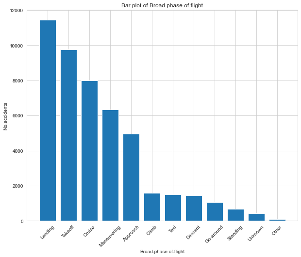

# Aviation Accidents in USA 

As company expands into the aviation industry, it'w worth understanding how to operate airplanes for both commercial and private purposes. However, before making any purchasing decisions, it’s critical to understand the safety risks associated with different aircraft models. My role in this project is to analyze historical aviation accident data and determine which aircraft are the safest, ensuring that the company makes informed, data-driven decisions that minimize risk and enhance operational safety.

## Objective 

The primary goal of this project is to use data from the NTSB (National Transportation Safety Board) aviation accident database to assess the safety performance of various aircraft models. By looking at accident rates, injury severity, and the types of damage aircraft experience, I'll be able to identify which models are safest and best suited for our intended operations—whether commercial or private.

## Business Understanding

1. Safety Records: I'll start by examining the overall accident rates for each aircraft model, identifying how many incidents have occurred. This will include:

* Accident Rates per Model: I'll analyze how frequently accidents or incidents are associated with each aircraft.
* Injury Severity: I’ll look at how many of these accidents involve serious or fatal injuries to get a clearer picture of safety performance.
* Aircraft Damage: By analyzing whether accidents result in minor, major, or complete destruction, I can assess which models are prone to significant damage.
2. Flight Purpose:Breaking down the data based on the "Purpose of flight" column (e.g., personal, business, instructional), which will allow me to differentiate between aircraft used for private and commercial purposes. This will help tailor recommendations to our company’s specific operational needs, such as focusing on models that perform well in business or commercial contexts.

3. Phases of Flight: Accidents often occur during specific phases of flight (e.g., takeoff, cruise, landing), so I’ll analyze this data to see which aircraft models perform well during each phase. Understanding these patterns will help ensure that we choose aircraft that are safe for the types of operations and flight phases we expect to encounter most often.

4. Weather Conditions: The dataset includes a column for "Weather Condition" (VMC—Visual Meteorological Conditions, IMC—Instrument Meteorological Conditions), which I'll use to determine how different models perform in varying weather conditions. This will be important for assessing which aircraft can handle diverse operational environments, especially if we’re flying in areas with unpredictable weather.

## Data Understanding and Analysis

### Source of Data:
The data comes from the **National Transportation Safety Board (NTSB)**, which records aviation accidents and incidents across various aircraft models. The dataset includes information on accidents by flight phase, weather conditions, and the purpose of the flight. This rich dataset helps identify patterns and trends related to aviation safety, providing crucial insights for risk assessment in different types of aircraft operations.

### Description of Data:
The dataset contains **90,348 records** with **31 columns**, covering various aspects of aviation accidents, including:

**Categorical variables:**
- **Aircraft models** (e.g., Cessna, Piper, Beechcraft)
- **Flight phases** (e.g., landing, takeoff, cruise)
- **Weather conditions** (VMC, IMC)
- **Purpose of flight** (e.g., personal, instructional, business)
- **Accident severity** (e.g., fatal, non-fatal)
- **Aircraft damage** (e.g., minor, major, destroyed)
- **Investigation type** (accident vs. incident)

**Numerical variable:**

- **Number of Engines:** The engine configuration of the aircraft, which can impact safety.
- **Injury Data:** Variables including Total Fatal Injuries, Total Serious Injuries, Total Minor Injuries, and Total Uninjured passengers.

This comprehensive dataset enables a detailed examination of accident rates, causes, and trends, particularly regarding the number of engines and injury outcomes. By using a line plot we can observe the trend of the aviation accidents from the year 1980 -2023

> Based on the data it's evident that there is a downward trend in the accident cases this could probably be brought about by the incoperating new technologies and better measures to help reduce the accidents cases.

Understanding the column for *Purpose of flight* (e.g., personal, business, instructional). Is a crucial step for this analysis as it will help differentiate between aircraft used for private versus commercial purposes for the interest of purchasing and operating airplanes for commercial and private enterprises.

> The data on Investigation Type highlights that the Cessna 152 model is associated with the highest number of incidents or investigations (2,083), followed by the Cessna 172 (1,494) and Cessna 172N (930). Piper models like the PA-28-140 (775) and 150 (731) also feature prominently. These findings suggest that these models, especially popular training aircraft like the Cessna 152 and 172, are frequently involved in incidents, possibly due to their widespread use in flight schools and for personal aviation.

The column *Broad phase of flight* will help identify during which flight phase (e.g., takeoff, cruise, landing) accidents tend to occur for different aircraft. This could reveal models that are safer in particular phases, which is valuable when considering usage patterns.

> Landing and takeoff are the most accident-prone phases, with 11,444 and 9,754 accidents/incidents, highlighting the complexity and risks involved in these critical moments. Cruise (7,987) and maneuvering (6,341) phases also see significant accidents/incidents due to mechanical issues or sharp turns. Approach (4,955) poses risks during landing preparations. While climb, taxi, and descent have fewer accidents/incidents, they still present risks from engine failures or misjudgments. Go-around and standing accidents/incidents show additional concerns.

*Weather Conditions* greatly impact aviation industries in this scenario we will investigate the various weather conditions and try to seek insights in relation to the model of the plane.

The Weather.Condition column contains (VMC—Visual Meteorological Conditions, IMC—Instrument Meteorological Conditions and Unknown). By compairing the different model planes  can reveal which aircraft perform better under certain weather conditions.

**IMC (Instrument Meteorological Conditions):**

* Aircraft like the PA-28-181, 172N, and A36 have higher accident rates in IMC, with 73, 69, and 66 incidents, respectively. These conditions involve poor visibility, making navigation challenging. For operations frequently conducted in low-visibility or adverse weather, these models may require extra caution.

**VMC (Visual Meteorological Conditions):**

* Aircraft such as the 152, 172, and 172N have significantly more accidents in VMC, with 2,011, 1,410, and 848 incidents, respectively. Since VMC accidents occur in good visibility, they may indicate human error or mechanical issues during simpler conditions.

## Conclusion and Recommendation

- In conclusion, prioritizing safety in aviation operations, particularly for personal and instructional flights, requires a multifaceted approach that includes scrutinizing commonly used aircraft models and ensuring they are well-maintained and equipped with advanced safety technologies. Implementing comprehensive pilot training, especially in instrument flight for models like the PA-28-181, 172N, and A36, is essential to enhance situational awareness and reduce reliance on visual cues. Additionally, selecting aircraft with strong safety records and enforcing stricter maintenance schedules will significantly mitigate risks associated with varied pilot experience levels and environmental conditions. Through these measures, we can create a safer aviation environment for both pilots and passengers.

## Refrences 
For More Tableu visualization: [Click here 👇🏿](https://public.tableau.com/app/profile/savins.nanyaemuny/viz/TableauVisualization_17272562742990/AviationAccidentsinUSA?publish=yes)

